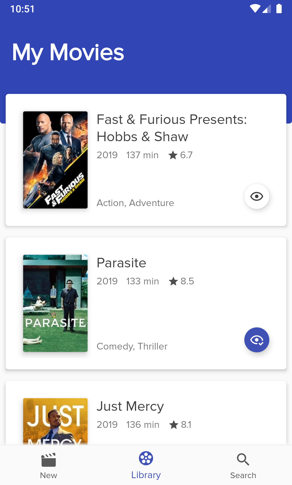
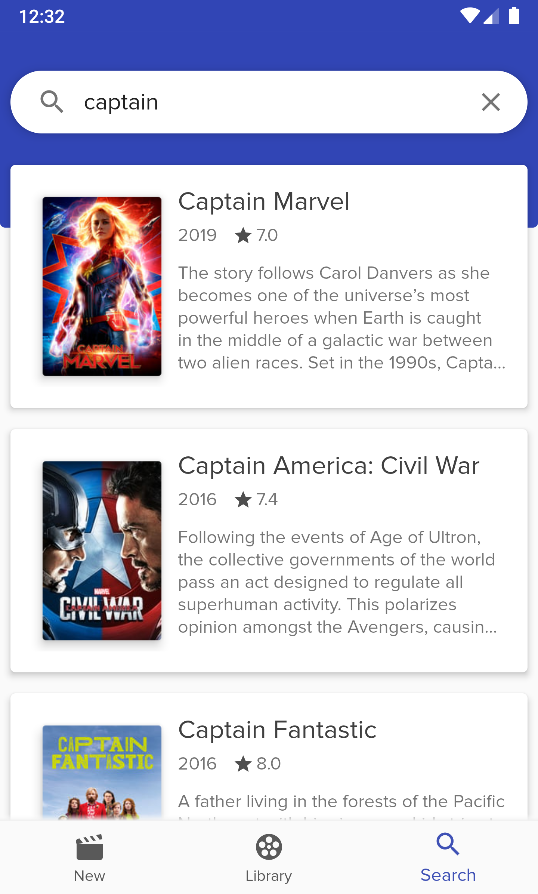

#  Spotlight

  
<br /><br />
Spotlight is an app to look up movies and save them to a personal watch-list.
<br /><br />

<p float="left">



</p>

## About

Spotlight is a movie app, which let's the user check for newly released movies or search for a specific movie. It is also possible to save movies in a personal library and mark them as watched.
Spotlight shows details about a movie like the storyline, images, cast and reviews.


## Uses

- Multi module app (feature and core modules)
- Navigation Component (navigation between fragments)
- Viewbinding
- Viewmodel + StateFlow
- Coroutines + Flow (async data flow)
- Dagger 2 (dependency injection)
- Repository Pattern
- Retrofit (API calls)
- Room (database)
- Picasso (image loading)
- Palette (themeing)
- Turbine + Mockito (testing)

## Building

1. Get a API key for the tmdb.org movie database [here](https://www.themoviedb.org/settings/api)
2. Paste the key into the `Credentials.kt` file
3. Build the app in Android Studio

## License

```
Spotlight
Copyright © 2020 SNAD

This program is free software: you can redistribute it and/or modify
it under the terms of the GNU General Public License as published by
the Free Software Foundation, either version 3 of the License, or
(at your option) any later version.

This program is distributed in the hope that it will be useful,
but WITHOUT ANY WARRANTY; without even the implied warranty of
MERCHANTABILITY or FITNESS FOR A PARTICULAR PURPOSE.  See the
GNU General Public License for more details.

You should have received a copy of the GNU General Public License
along with this program.  If not, see <https://www.gnu.org/licenses/>.
```
See [LICENSE](LICENSE.md) to read the full text.
